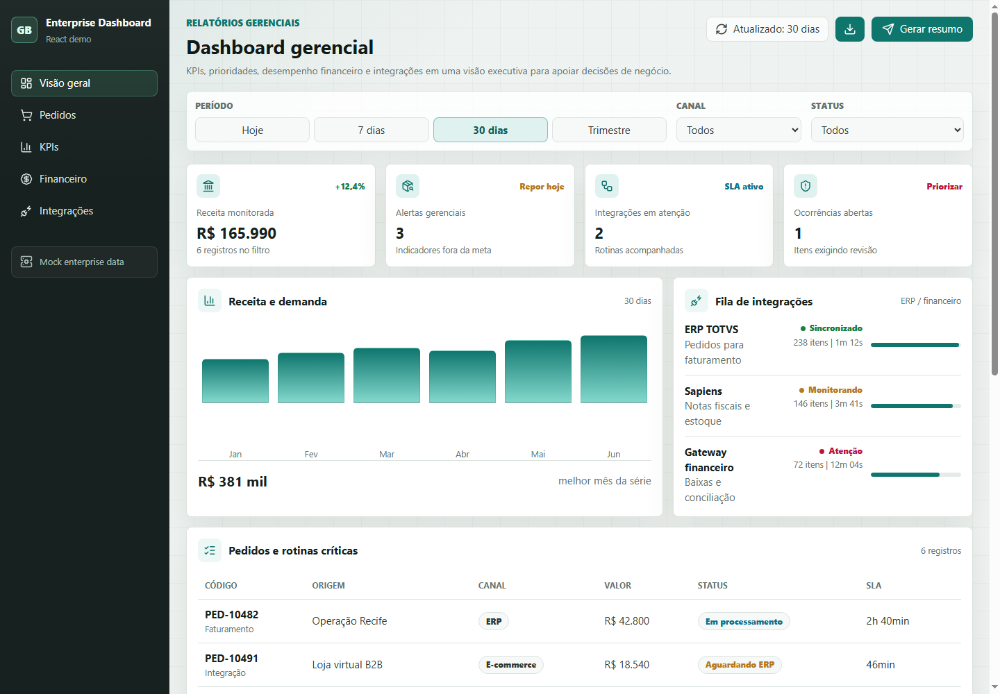

# Enterprise Dashboard React

Dashboard gerencial em React para leitura executiva de indicadores, prioridades, desempenho financeiro e pontos de decisão em uma operação empresarial.

[](https://georgebarret0.github.io/enterprise-dashboard-react/)
[](#stack)



## Visão geral

Este projeto foi criado como peça de portfólio para demonstrar construção de interfaces administrativas com foco em gestão, leitura de dados e tomada de decisão.

A proposta não é simular uma empresa específica, mas representar problemas comuns em sistemas corporativos: acompanhamento de KPIs, alertas operacionais, integrações, financeiro, pedidos e prioridades de revisão.

## Funcionalidades

- Indicadores executivos de receita, alertas, integrações e ocorrências.
- Filtros por período, canal e status.
- Cards de prioridade para leitura rápida da operação.
- Gráfico de receita e demanda.
- Fila de integrações com ERP e financeiro.
- Tabela de pedidos e visão operacional.
- Resumo financeiro e indicadores de conciliação.
- Layout responsivo para desktop, tablet e celular.

## Stack

- React
- JavaScript
- CSS moderno
- Lucide Icons
- Dados mockados para simular ambiente empresarial

## Como executar

Este projeto é estático e pode ser aberto diretamente pelo navegador ou servido pelo AppServ.

```text
C:\AppServ\www\git\enterprise-dashboard-react
```

URL local:

```text
http://localhost/git/enterprise-dashboard-react/
```

## Objetivo técnico

O foco deste projeto é mostrar:

- organização de tela para indicadores empresariais;
- composição visual de dashboard;
- filtros e estados de interface;
- hierarquia de informação;
- experiência frontend objetiva, sem estética genérica de landing page.

## Próximas evoluções possíveis

- Conectar com uma API Laravel.
- Persistir filtros no navegador.
- Adicionar autenticação simples.
- Exportar dados em CSV.
- Evoluir para Vite + TypeScript.
