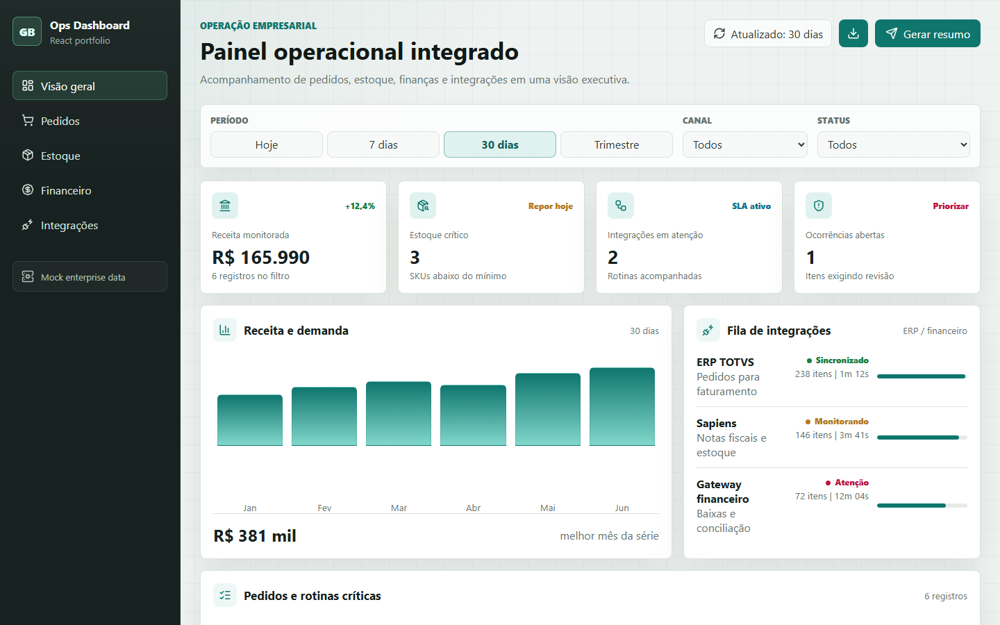

# Ops Dashboard React

Dashboard operacional em React para demonstrar uma visão corporativa de pedidos, estoque, conciliação financeira e integrações com sistemas empresariais.

Este projeto foi criado como peça de portfólio para mostrar experiência em interfaces administrativas, sistemas internos, dados operacionais, APIs e rotinas de negócio.

## Preview



## Funcionalidades

- Indicadores de receita, estoque crítico, integrações e ocorrências.
- Filtros por período, canal e status.
- Tabela de pedidos e rotinas operacionais.
- Painel de integrações com ERP e financeiro.
- Monitoramento simples de estoque mínimo.
- Resumo de conciliação financeira.
- Layout responsivo para desktop, tablet e celular.

## Tecnologias

- React
- JavaScript
- CSS moderno
- Lucide Icons
- Dados mockados representando um ambiente empresarial

## Como executar no AppServ

Coloque a pasta do projeto em:

```txt
C:\AppServ\www\git\ops-dashboard-react
```

Depois acesse:

```txt
http://localhost/git/ops-dashboard-react/
```

## Objetivo técnico

O foco não é simular uma empresa real, mas mostrar domínio sobre problemas comuns em sistemas corporativos:

- acompanhamento de operação;
- rotinas de ERP;
- controle de estoque;
- conciliação financeira;
- pedidos e status de processamento;
- telas administrativas objetivas.

## Próximas evoluções possíveis

- Conectar com uma API Laravel.
- Persistir filtros no navegador.
- Adicionar autenticação simples.
- Criar exportação CSV.
- Transformar em Vite + Tailwind CSS.
